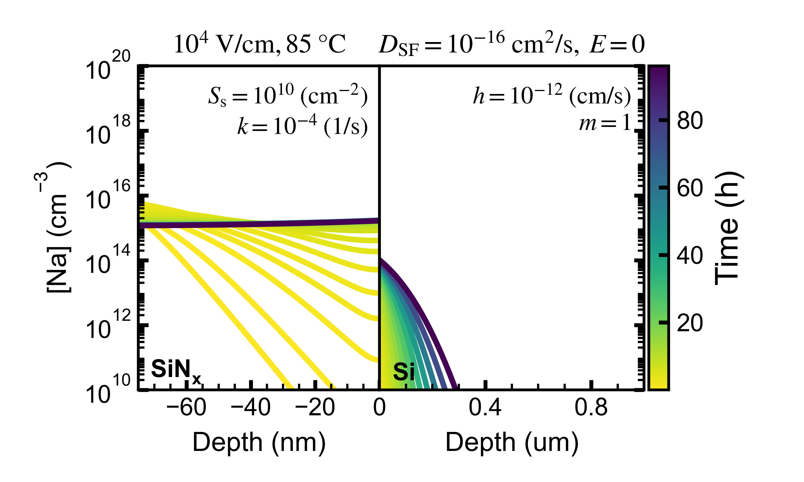
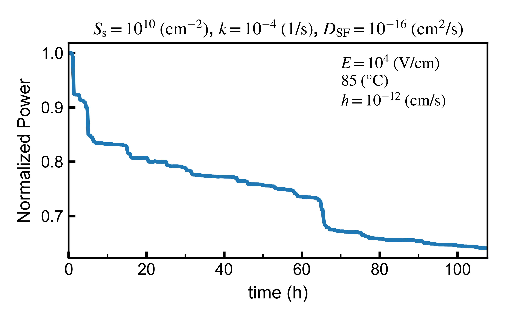

One-factor-at-a-time simulations
================================
The module `pnptransport.parameter_span` provides functions to multiple input files necessary to simulate the
effect of the variation of a specific parameter.

The following scripts provides an example of the usage:

.. literalinclude:: ../../one_factor_at_a_time.py
    :language: python
    :linenos:
    :caption: one_factor_at_a_time.py
    :name: Example of a parameter span

The script will use the `csv` file defined in `csv_file` which has the following form

.. csv-table:: Parameter Span CSV input
    :file: one_factor_at_a_time_lower_20200828_h=1E-12.csv
    :header-rows: 1

**sigma_s** corresponds to the surface concentration at the source :math:`S` in cm\ :sup:`-2` \, **zeta** corresponds
to the rate of ingress from the source :math:`k` in s\ :sup:`-1` \, **DSF** is the diffusivity of Na in the stacking
fault :math:`D_{\mathrm{SF}}` in cm\ :sup:`2`\/s, **E** is the electric field in SiN\ :sub:`x`\ given in V/cm, h and m
are the surface mass transfer coefficient (cm/s) and segregation coefficient at the SiN\ :sub:`x`\/Si interface,
respectively. The **recovery time** is indicated in seconds and corresponds to time added to the simulation where
the system is either (1) allowed to relax by removing the electric stress or, (2) stressed under the PID stress in
reverse polarity. The value of the recovery electric field is indicated in the last row of the table.

The column *base* corresponds to the base case to compare the rest of the simulations. The span column indicates
all the variations from the base case for the respective parameter in the row, while keeping the rest of the parameters
constant.

After running the code, the following file structure will be created

which will generate a folder structure like this.

::

   base_folder
   |---one_factor_at_a_time.csv
   |---input
   |   |---constant_source_flux_96_85C_1E+10pcm2_z1E-04ps_DSF1E-14_1E+01Vcm_h1E-12_m1E+00_rt12h_rv-1E+01Vcm.ini
   |   |---constant_source_flux_96_85C_1E+10pcm2_z1E-04ps_DSF1E-14_1E+02Vcm_h1E-12_m1E+00_rt12h_rv-1E+02Vcm.ini
   |   |--- ...
   |   |---ofat_db.csv
   |   |---batch_YYYYMMDD.sh

With :math:`n` .ini files corresponding to all of the variations. The naming convention for the .ini files is
`constant_source_flux_` + PID stress time in hours + `_` + :math:`T` in °C + `C_` + :math:`S`
in cm\ :sup:`-2`\ + `pcm2_z` + :math:`k` in s\ :sup:`-1` \ + `ps_DSF` + :math:`D_{\mathrm{SF}}` in
cm\ :sup:`2`\/s + `_` + :math:`E` in V/cm + `_h` + :math:`h` in cm/s + `_m` + :math:`m` + `_rt` +
recovery time in hours + `h_rv` + recovery voltage (at the SiN\ :sub:`x`\) in V/cm.

Additionally, the scripts create a batch script `batch_YYYYMMDD.sh` that needs to be run in the location where
`simulate_fs.py` can be reached. This will send all the simulations as separate python jobs to the OS.

Lastly, the script generates a `ofat_db.csv` table containing the list of all simulations with all the parameters
used in each case:

.. csv-table:: OFAT Database
    :file: ofat_db.csv
    :header-rows: 1

Depending on the choice of parameters, large concentration and potential gradients can lead to non-convergent
simulations. The batch script will run the remainder of the simulations that do converge. Adjustments to the time step
and mesh elements might be needed to reach convergence. In any case, it is convenient to add an additional column to
`ofat_db.csv` to flag if the simulation converged for further batch analysis.

One-factor-at-a-time analysis
=============================
A script is provided to analyze the output of one-factor-at-a-time batch simulations, which plots the concentration
profile as a function of time for each simulation and also simulates the :math:`P_{\mathrm{mpp}}` and
:math:`R_{\mathrm{sh}}` as a function of time using a Random Forrest Regression model fit from previous Sentaurus
simulations.

.. literalinclude:: ../../one_at_a_time_analysis.py
    :language: python
    :linenos:
    :caption: one_factor_at_a_time_analysys.py

Change the path to the csv file using the variable `path_to_csv` on line 28 to point to the csv `ofat_db.csv` from the
previous simulation. Also update the path to which the results are expected to be stored by changing the variable
`path_to_results` on line 29.

`t_max_h` in line 30 represents the maximum time to be plotted.

For each simulation the following plots are generated

1. A plot of the Na concentration profile as a function of time indicated in color scale. Saved in png and svg (vector)
   formats.
2. A plot of :math:`P_{\mathrm{mpp}}` as a function of time. Saved in png and svg (vector) formats. Additionally a
   csv file is generated with the data from the plot.
3. A plot showing the average concentration in each layer, as a function of time. Save in png format.

The output is saved
within the `path_to_output` using the following structure

::

   output_folder
   |---batch_analysis
   |   |---constant_source_flux_96_85C_1E+10pcm2_z1E-04ps_DSF1E-14_1E+01Vcm_h1E-12_m1E+00_rt12h_rv-1E+01Vcm_c.png
   |   |---constant_source_flux_96_85C_1E+10pcm2_z1E-04ps_DSF1E-14_1E+01Vcm_h1E-12_m1E+00_rt12h_rv-1E+01Vcm_c.svg
   |   |---constant_source_flux_96_85C_1E+10pcm2_z1E-04ps_DSF1E-14_1E+01Vcm_h1E-12_m1E+00_rt12h_rv-1E+01Vcm_p.png
   |   |---constant_source_flux_96_85C_1E+10pcm2_z1E-04ps_DSF1E-14_1E+01Vcm_h1E-12_m1E+00_rt12h_rv-1E+01Vcm_p.svg
   |   |---constant_source_flux_96_85C_1E+10pcm2_z1E-04ps_DSF1E-14_1E+01Vcm_h1E-12_m1E+00_rt12h_rv-1E+01Vcm_s.svg
   |   |---constant_source_flux_96_85C_1E+10pcm2_z1E-04ps_DSF1E-14_1E+01Vcm_h1E-12_m1E+00_rt12h_rv-1E+01Vcm_simulated_pid.csv
   |   |---constant_source_flux_96_85C_1E+10pcm2_z1E-04ps_DSF1E-14_1E+02Vcm_h1E-12_m1E+00_rt12h_rv-1E+02Vcm_c.png
   |   |--- ...
   |   |---ofat_analysis.csv

This is an example of a concentration plot

    Example of a concentration plot from the batch analysis.

This is an example of a :math:`P_{\mathrm{mpp}}` plot

    Example of a :math:`P_{\mathrm{mpp}}` plot from the batch analysis.